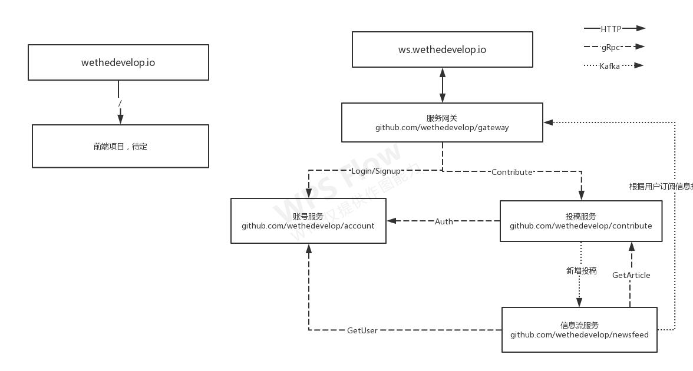

# wethedevelop.io

## 简介
[WeTheDevelop.io](https://github.com/wethedevelop/wethedevelop.io)是一块技术试验田，他的目标是尽可能的使用最新最有趣的技术去搭建一个类似于v2ex的开源技术社区。

[WeTheDevelop.io]并不是一个“正经”的项目，如果一个技术栈足够“有趣”，让程序员们乐意去使用，他就会被采用进来。后端的微服务，链路追踪，服务网格，K8S，日志服务；前端的微架构，全新编写的双向绑定，等等。

## 口号

叠最厚的buff，挨最痛的打。

## 架构图

项目整体文档: [https://github.com/wethedevelop/wethedevelop.io](https://github.com/wethedevelop/wethedevelop.io)

网关服务: [https://github.com/wethedevelop/gateway](https://github.com/wethedevelop/gateway)

账号微服务: [https://github.com/wethedevelop/account](https://github.com/wethedevelop/account)

proto接口描述文件: [https://github.com/wethedevelop/proto](https://github.com/wethedevelop/proto)

## 采用新技术的一个常见步骤

假设我们要采用jager（猎人）来做链路追踪。

0. 你想采用技术，你决定成为这个技术的owner（负责人）
1. 你要把jager的库整合到这个项目中，在比较经典的场景里插入链路追踪需要的埋点代码。  
    1.1. 截图链路追踪图，拓扑图，对jager的效果做一个介绍，描述他的好处，放在pull request中提上来。  
    1.2. 初步审批，合入测试分支，我们在测试环境搭建jager需要的环境，然后重现上述描述的场景，获得效果和数据。  
2. 编写更为完整的技术文档，方便后面的人能跟上你的技术栈采用。
3. 测试完毕、文档完善、这个技术栈可以被做下去，社区会同意合入代码。
4. 运维同学部署到生产环境，成为生态的一部分。
5. ~永远 希望你能保证这个技术栈能继续使用下去，而不是从此荒废了。如果荒废了的技术，有可能在后面被剔除出去。

## 里程碑

1. 网站上线，具有投稿的能力（还未）

## 现在我们已经采用的技术

#### 微服务